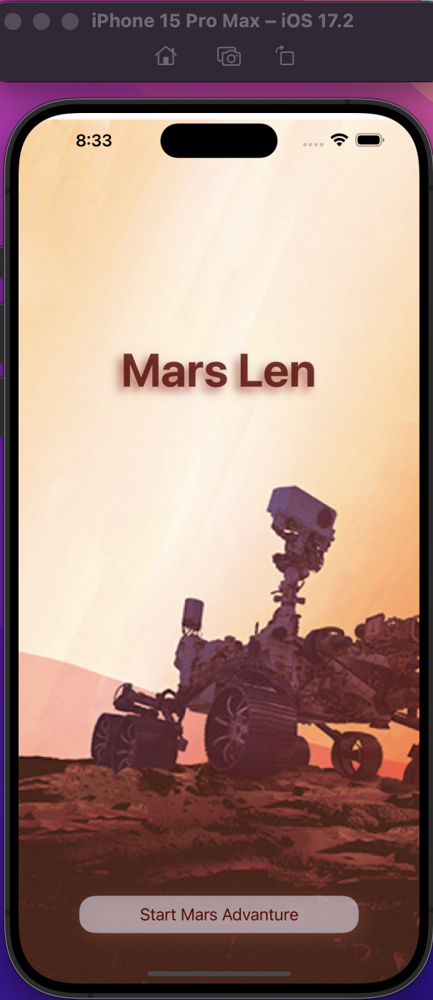
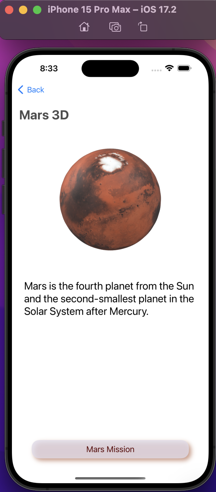
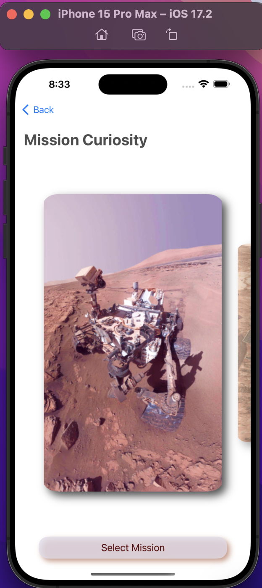
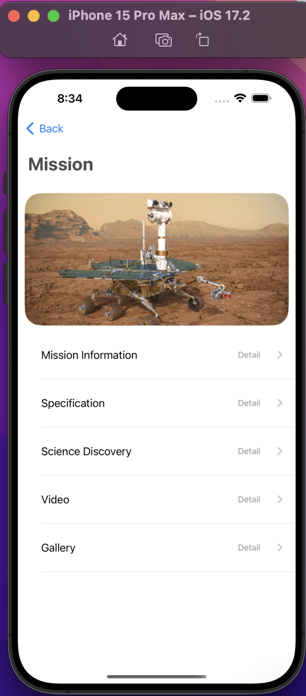
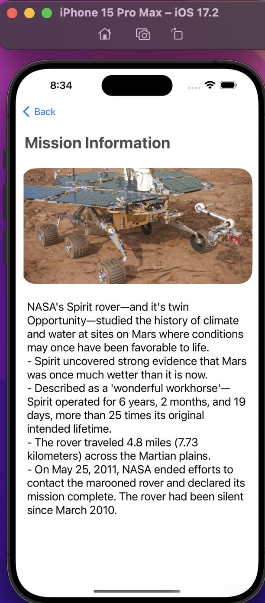
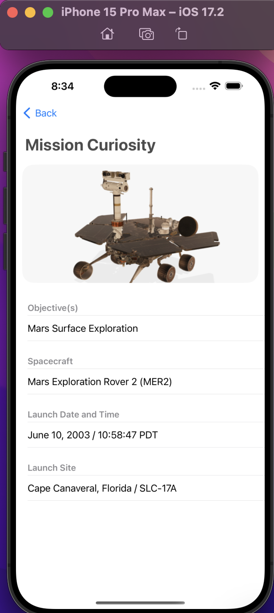
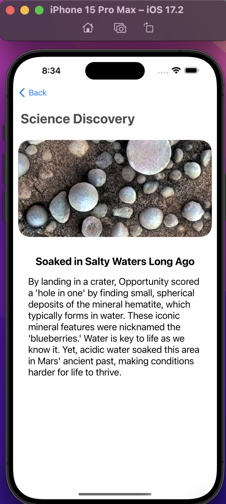
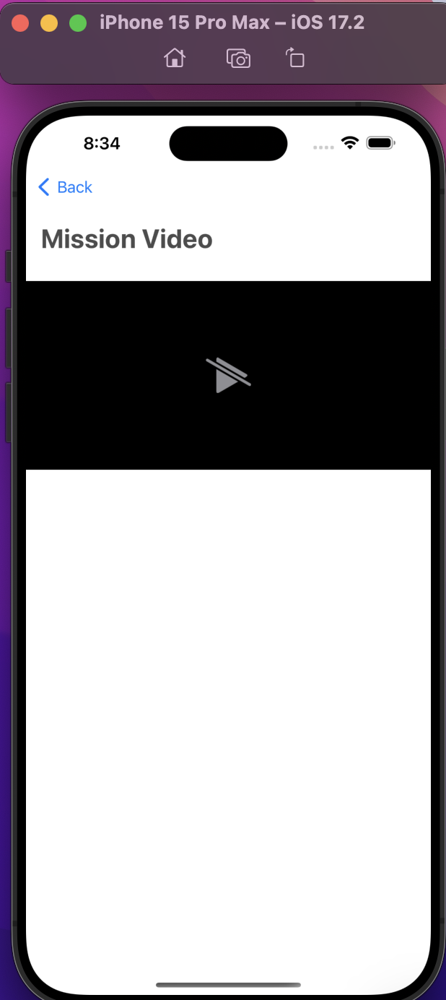
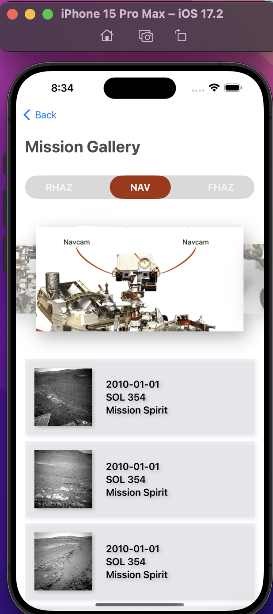
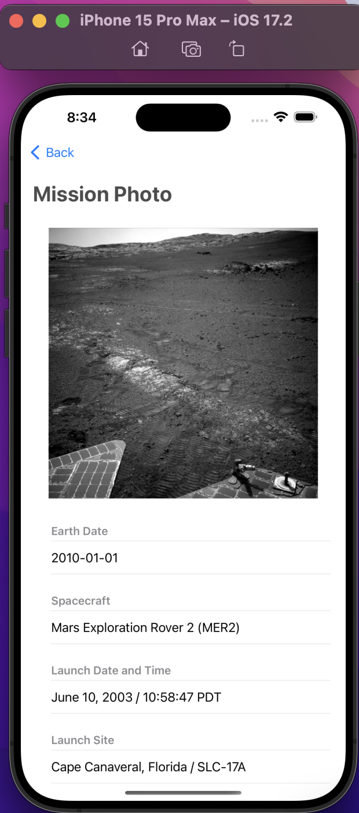

# iOS MarsLens

A repo of MarsLen, an iOS2 course project using SwiftUI.

---

## Prototype

[Figma](https://www.figma.com/file/cQbuhHur0rfuOx61jLZZIJ/iOS2-FinalProject?type=design&node-id=1%3A3&mode=design&t=XrWukho9xGR1FWSa-1)

---

- Version 1.0

---

[TOP](#ios-marslens)
